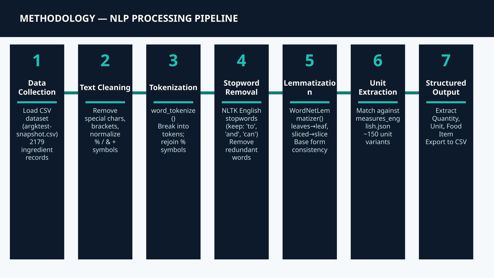
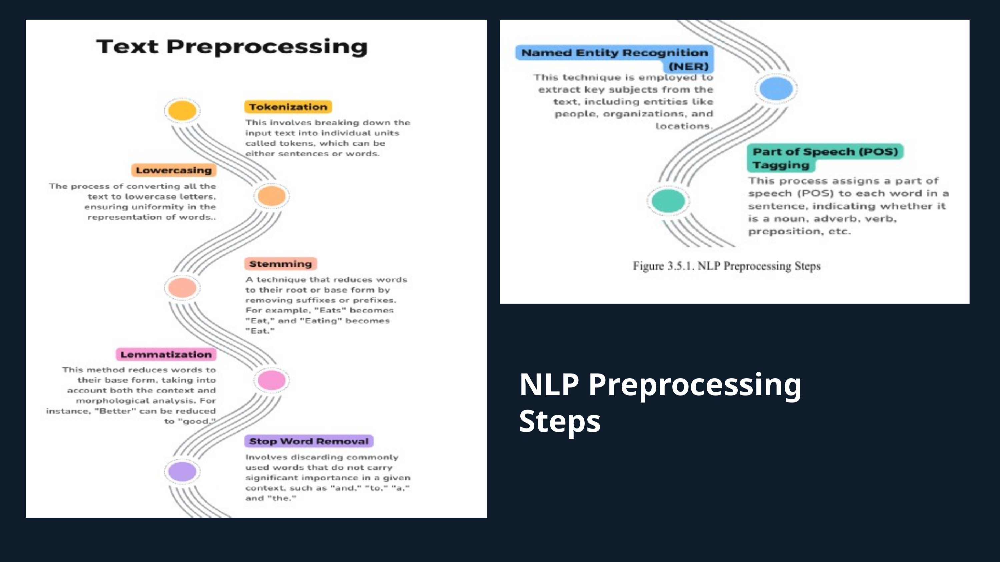
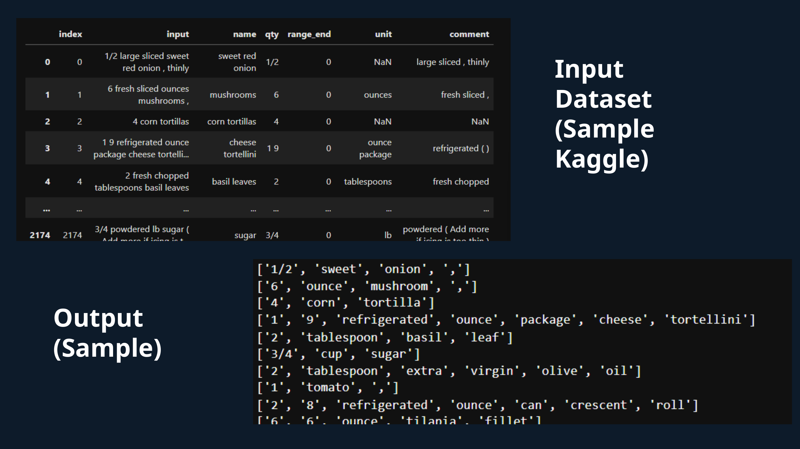
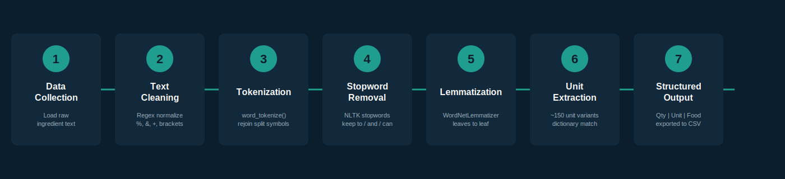
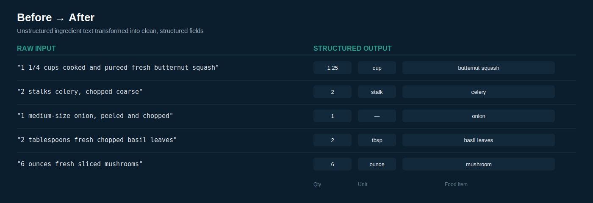

# Automated Text Structuring Pipeline (NLP)

An end-to-end NLP pipeline that transforms messy, unstructured ingredient text into clean, structured data — **Quantity, Unit, and Food Item** — using Python, NLTK, and Regex, processed at scale across ~179,000 records.

> This project reflects the type of text-structuring work I did as a **Data Analyst Intern at Consecution Marketing & Tie-ups, Bengaluru (Jan–Jun 2026)**, where I built a pipeline to convert raw ingredient text from restaurant partners into structured fields, which the ML team then fed into Transformer-based Models downstream.
>
> Since the original client data and codebase can't be shared publicly, this repo is an **independent reproduction built from scratch** on a public dataset (the [NYT Ingredient Phrase corpus](https://github.com/nytimes/ingredient-phrase-tagger), ~179,000 records) to demonstrate the same problem-solving approach and pipeline design — not the original company project or data.

---

## Project Presentation

For a visual walkthrough of the project—including the system architecture, NLP pipeline, preprocessing steps, implementation details, sample outputs, business applications, and future improvements—see the presentation below.

**Presentation:** [Structured_NLP_Presentation.pptx](Structured_NLP_Presentation.pptx)

A few slides from the presentation are shown below.

<p align="center">
  
</p>

<p align="center">
  
</p>

<p align="center">
  
</p>

## Table of Contents
- [Problem](#problem)
- [Pipeline Architecture](#pipeline-architecture)
- [Sample Results](#sample-results)
- [Skills & Tools Demonstrated](#skills--tools-demonstrated)
- [Tech Stack](#tech-stack)
- [Repository Structure](#repository-structure)
- [Scope & Limitations](#scope--limitations)
- [Other Projects](#other-projects)

---

## Problem

Ingredient lines in real-world text are inconsistent — mixed units, abbreviations, fractions, and redundant descriptors:

```
"1 1/4 cups cooked and pureed fresh butternut squash"
"2 tablespoons fresh chopped basil leaves"
"6 ounces fresh sliced mushrooms"
```

This pipeline parses free text like this into clean, tabular data ready for downstream use (search, filtering, recommendation systems, or as input to further ML models).

## Pipeline Architecture



1. **Text Cleaning** — regex-based normalization of `%`, `&`, `+`, brackets, and digit-based fraction/range formatting
2. **Tokenization** — `nltk.word_tokenize()`, with symbol-rejoin post-processing
3. **Stopword Removal** — NLTK English stopwords, with task-critical words (`to`, `and`, `can`) retained
4. **Redundant Word Filtering** — a descriptor vocabulary (e.g. `fresh`, `chopped`, `sliced`) built dynamically from the dataset's own comment text, rather than hardcoded
5. **Lemmatization** — `WordNetLemmatizer()` for base-form consistency (`leaves` → `leaf`)
6. **Quantity Normalization** — custom parsing to resolve mixed fractions (`1 1/4` → `1.25`) and multiplication patterns
7. **Unit Extraction** — matches tokens against a ~150-entry unit dictionary (`measures_english.json`), with special handling for context-dependent pairs (e.g. `clove` + `garlic`, `sprig` + `parsley`)
8. **Structured Output** — final `Quantity | Unit | Food Item` columns exported to CSV

## Sample Results



## Skills & Tools Demonstrated

**Data Analysis & Data Science**
- Data Cleaning & Wrangling on noisy, real-world text at scale (~179K records)
- Exploratory Data Analysis (EDA) to profile raw data structure and surface recurring noise patterns
- Feature Extraction — deriving structured fields (quantity, unit, entity) from free text
- End-to-end Data Pipeline Design — raw text in, analysis-ready tabular data out
- Batch Processing & Data Validation across large datasets

**Natural Language Processing (NLP)**
- Tokenization, Stopword Removal, and Lemmatization using NLTK
- Regex-based Pattern Matching & Text Normalization
- Dictionary/Lexicon-based Entity Recognition (custom unit & measurement lexicon)
- Text Preprocessing pipelines designed to feed downstream ML/Transformer models

**Tools & Technologies**

`Python` · `Pandas` · `NLTK` · `Regex` · `JSON` · `Jupyter Notebook` · `CSV/Data I-O` · `Git & GitHub`

## Tech Stack

| Category | Tools |
|---|---|
| Language | Python |
| NLP | NLTK (`punkt`, `wordnet`, `omw-1.4`, stopwords, lemmatizer) |
| Data Handling | Pandas |
| Text Processing | Regex (`re`) |
| Config | JSON (unit dictionary) |

## Repository Structure

| File | Description |
|---|---|
| `structured.ipynb` | Main notebook — full preprocessing and extraction pipeline |
| `nyt-ingredients-snapshot-2015.csv` | Public dataset used for this reproduction |
| `measures_english.json` | Dictionary of ~150 unit/measurement variants used for unit matching |
| `extracted_data.csv` | Sample structured output (Quantity, Unit, Food Item) |

## Scope & Limitations

This is a **rule-based** system (regex + dictionary + NLTK). The goal was to demonstrate robust, explainable text-structuring logic — the same class of problem I worked on during my internship. In the original production setting, the structured output from this stage fed into a separate pipeline built by the ML engineering team, which used transformer-based models for the downstream task.

**Possible extensions:**
- Named Entity Recognition (NER) to reduce rule dependency
- Transformer-based contextual extraction (e.g. BERT/RoBERTa) for ambiguous phrasing
- Real-time/streaming processing support

---
## Additional Documentation

A detailed project presentation explaining the methodology, architecture, implementation, preprocessing pipeline, and results is included in this repository.

**Presentation:** [Structured_NLP_Presentation.pptx](Structured_NLP_Presentation.pptx)

## Other Projects

A couple of other projects from my portfolio that may be relevant:

- **[Pharmaceutical Inventory Demand Forecasting](https://github.com/hamzaikram2026/Pharmaceutical-Inventory-Demand-Forecasting-using-Machine-Learning)** — Machine learning pipeline for pharmaceutical inventory analytics with temporal feature engineering using `RandomForestRegressor` (R² = 0.95)
- **[AutoInsight](https://github.com/hamzaikram2026/AutoInsight-Automated_EDA-Predictive_Modeling_Pipeline-)** — An automated EDA + predictive modeling pipeline built as a Streamlit app

---

## Author

**Hamza Ikram** — [github.com/hamzaikram2026](https://github.com/hamzaikram2026)
